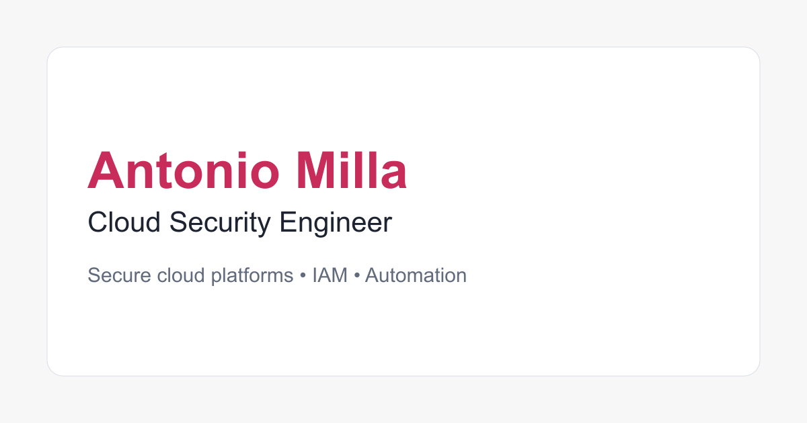

<p align="center">
  <a href="https://www.amilla.es/">
    
  </a>
</p>

<h1 align="center">amilla.es</h1>

<p align="center">
  Personal portfolio for Antonio Milla, built with the web platform and no runtime dependencies.
</p>

<p align="center">
  <a href="https://www.amilla.es/"></a>
  <a href="https://github.com/antoniomml/amilla-web/actions/workflows/quality.yml"></a>
  <a href="https://github.com/antoniomml/amilla-web/releases/latest"></a>
  <a href="LICENSE"></a>
  
</p>

<p align="center">
  <a href="https://www.amilla.es/">Visit the website</a>
  ·
  <a href="https://github.com/antoniomml/amilla-web/releases/latest">Latest release</a>
</p>

## About

The production site is intentionally built with plain HTML, CSS and JavaScript. Development dependencies are used only to generate assets and validate the repository; no framework or third-party JavaScript is shipped to visitors.

|                          |                                               |
| ------------------------ | --------------------------------------------- |
| **Languages**            | English, Spanish and French                   |
| **Hosting**              | Vercel                                        |
| **Production output**    | `public/`                                     |
| **Runtime dependencies** | None                                          |
| **Privacy**              | No analytics, cookies or third-party requests |

## Highlights

- Responsive, multilingual single-page portfolio with localized metadata and `hreflang`.
- Light and dark themes with an accessible manual toggle and reduced-motion support.
- Self-hosted Manrope and Sora variable fonts.
- Open Graph, Twitter and structured metadata for rich previews and search engines.
- Web app manifest, installable icons and a custom 404 page.
- Strict CSP, HSTS and supporting browser security policies configured for Vercel.

## Local development

Requirements: Node.js 22 or newer and Python 3 for the local static server.

```sh
npm install
npm run dev
```

Open <http://localhost:8000>. Serving the site over HTTP provides a closer match to production than opening `index.html` directly.

## Quality and security

Run the complete local suite:

```sh
npm test
```

The suite checks formatting, JavaScript, CSS, HTML, local references, production metadata, image dimensions and color contrast. GitHub Actions runs the same checks for every pull request and push to `main`, followed by `npm audit`.

The repository also uses CodeQL, Dependabot, secret scanning, push protection and immutable SHA references for GitHub Actions. The deployed site has no backend, analytics, cookies or third-party runtime resources; `localStorage` stores only the visitor's explicit theme choice.

## Project layout

<details>
<summary>View the repository structure</summary>

```text
public/
├── index.html
├── es/index.html
├── fr/index.html
├── 404.html
├── assets/
│   ├── fonts/
│   ├── icons/
│   └── images/
├── css/styles.css
├── js/
├── robots.txt
├── sitemap.xml
└── site.webmanifest
scripts/
├── generate-assets.mjs
└── verify-site.mjs
```

</details>

## Assets and deployment

Generate the social preview, application icons and local font assets with:

```sh
npm run assets
```

Vercel deploys only `public/`, using the headers and routing rules in `vercel.json`. The canonical production hostname is [www.amilla.es](https://www.amilla.es/).

## License

Source code, configuration, scripts and reusable markup are available under the [MIT License](LICENSE).

Portfolio copy, personal identity and brand-specific visual assets are excluded from that grant. See [CONTENT-LICENSE.md](CONTENT-LICENSE.md) for the exact scope. Third-party font licenses are included beside the deployed font files.
